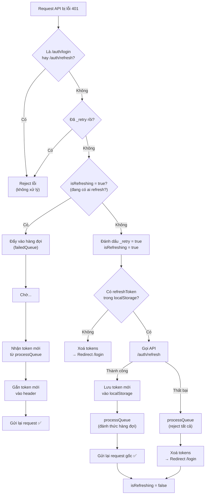

# Hướng dẫn chi tiết: Refresh Token & Hàng đợi (Queue)

> Giải thích từng dòng code trong [http.ts](file:///g:/React-2026-Rikkei/React-Product/src/lib/http.ts) cho người mới học.

---

## 📖 Phần 1: Tại sao cần Refresh Token?

### Câu chuyện đơn giản

Hãy tưởng tượng bạn đi vào một **công ty**:

1. Bạn đến quầy lễ tân, đưa **CMND** (username + password) → lễ tân cấp cho bạn **thẻ ra vào** (Access Token)
2. Thẻ ra vào này có **hạn sử dụng ngắn** (ví dụ: 15 phút) — vì nếu ai đó lấy cắp thẻ, họ chỉ dùng được 15 phút
3. Nhưng bạn không muốn cứ 15 phút lại phải ra lễ tân đưa CMND lại → nên lễ tân cấp thêm một **phiếu gia hạn** (Refresh Token)
4. Khi thẻ ra vào hết hạn, bạn chỉ cần đưa **phiếu gia hạn** để nhận thẻ mới, **không cần đưa CMND lại**

### Trong code thực tế

| Khái niệm | Ý nghĩa |
|---|---|
| **Access Token** | Token ngắn hạn (15-30 phút), gửi kèm mọi request API |
| **Refresh Token** | Token dài hạn (7-30 ngày), chỉ dùng để **xin Access Token mới** |
| **401 Unauthorized** | Server nói: "Thẻ ra vào của bạn hết hạn rồi!" |
| **Refresh Token Rotation** | Mỗi lần dùng Refresh Token, server cấp **cả cặp mới** (Access + Refresh) và **huỷ cái cũ** |

---

## 📖 Phần 2: Giải thích từng đoạn code

### 2.1 — Tạo HTTP Client

```typescript
// Dòng 1
import axios, { type InternalAxiosRequestConfig } from "axios";
```

- `axios` là thư viện giúp gọi API (GET, POST, PUT, DELETE...)
- `InternalAxiosRequestConfig` là kiểu dữ liệu mô tả cấu hình của 1 request

```typescript
// Dòng 3-5
interface CustomAxiosRequestConfig extends InternalAxiosRequestConfig {
  _retry?: boolean;
}
```

- Mở rộng config của axios, thêm thuộc tính `_retry`
- `_retry` là **cờ tự đặt** để đánh dấu: "request này đã thử refresh token rồi, đừng thử lại nữa"
- `?` nghĩa là **tuỳ chọn** — ban đầu không có, chỉ thêm khi cần

```typescript
// Dòng 12-17
const http = axios.create({
  baseURL: "http://localhost:3000/api",
  headers: {
    "Content-Type": "application/json",
  },
});
```

- Tạo 1 instance axios **riêng** (gọi là `http`)
- Mọi request qua `http` sẽ tự động có `baseURL` phía trước
- Ví dụ: `http.get("/products")` → gọi tới `http://localhost:3000/api/products`

---

### 2.2 — Biến quản lý trạng thái Queue

```typescript
// Dòng 7-10
interface QueueItem {
  resolve: (token: string) => void;
  reject: (error: unknown) => void;
}
```

- Mỗi item trong hàng đợi là 1 cặp `resolve/reject` của Promise
- `resolve(token)` = "OK, đây là token mới, tiếp tục đi"
- `reject(error)` = "Thất bại rồi, dừng lại"

```typescript
// Dòng 20-21
let isRefreshing = false;
let failedQueue: QueueItem[] = [];
```

| Biến | Ý nghĩa |
|---|---|
| `isRefreshing` | **Cờ hiệu**: Có đang gọi refresh token hay không? (`true` = đang gọi) |
| `failedQueue` | **Hàng đợi**: Danh sách các request bị 401, đang chờ token mới |

### Tại sao cần 2 biến này?

Hãy tưởng tượng 1 trang web load **5 API cùng lúc** (danh sách sản phẩm, giỏ hàng, thông tin user, thông báo, banner). Cả 5 đều cần Access Token. Nếu token hết hạn:

- ❌ **Không có queue**: Cả 5 request đều gọi refresh token → server nhận 5 request refresh → chỉ cái đầu thành công, 4 cái sau bị từ chối (vì Refresh Token Rotation đã huỷ token cũ)
- ✅ **Có queue**: Request đầu tiên gọi refresh token, 4 request còn lại **xếp hàng chờ**. Khi refresh xong → cả 5 đều dùng token mới

---

### 2.3 — Hàm xử lý Queue

```typescript
// Dòng 23-32
const processQueue = (error: unknown, token: string | null = null) => {
  failedQueue.forEach((prom) => {
    if (error) {
      prom.reject(error);      // Refresh thất bại → reject tất cả
    } else if (token) {
      prom.resolve(token);     // Refresh thành công → gửi token mới cho tất cả
    }
  });
  failedQueue = [];            // Xoá sạch hàng đợi
};
```

**Ví dụ minh hoạ:**

```
failedQueue = [
  { resolve: fn1, reject: fn1_err },   // Request lấy sản phẩm
  { resolve: fn2, reject: fn2_err },   // Request lấy giỏ hàng  
  { resolve: fn3, reject: fn3_err },   // Request lấy thông báo
]

// Refresh thành công với token "abc123":
processQueue(null, "abc123")
→ fn1("abc123")  → Request sản phẩm retry với token mới
→ fn2("abc123")  → Request giỏ hàng retry với token mới
→ fn3("abc123")  → Request thông báo retry với token mới
→ failedQueue = []  (xoá sạch)

// Hoặc refresh thất bại:
processQueue(refreshError, null)
→ fn1_err(refreshError)  → Request sản phẩm báo lỗi
→ fn2_err(refreshError)  → Request giỏ hàng báo lỗi
→ fn3_err(refreshError)  → Request thông báo báo lỗi
→ failedQueue = []  (xoá sạch)
```

---

### 2.4 — Request Interceptor (chặn TRƯỚC khi gửi request)

```typescript
// Dòng 35-44
http.interceptors.request.use(
  (config) => {
    const accessToken = localStorage.getItem("accessToken");
    if (accessToken) {
      config.headers.Authorization = `Bearer ${accessToken}`;
    }
    return config;
  },
  (error) => Promise.reject(error)
);
```

**Interceptor là gì?** Giống như một **trạm kiểm soát**:
- **Request interceptor** = trạm kiểm soát **trước khi gửi** request
- **Response interceptor** = trạm kiểm soát **sau khi nhận** response

**Đoạn này làm gì?**
- Mỗi khi `http` gửi request, **tự động** lấy Access Token từ localStorage
- Gắn vào header: `Authorization: Bearer eyJhbGciOi...`
- Nhờ vậy, bạn **không cần** tự thêm token vào mỗi request

```
// Không cần viết:
http.get("/products", { headers: { Authorization: `Bearer ${token}` } })

// Chỉ cần viết:
http.get("/products")   // ← interceptor tự thêm token
```

---

### 2.5 — Response Interceptor (phần QUAN TRỌNG NHẤT)

Đây là phần xử lý refresh token. Mình sẽ chia nhỏ từng bước:

#### Bước 1: Kiểm tra có phải lỗi 401 không?

```typescript
// Dòng 47-60
http.interceptors.response.use(
  (response) => response,          // Response OK → trả về bình thường
  async (error) => {               // Response LỖI → vào đây
    const originalRequest = error.config as CustomAxiosRequestConfig | undefined;

    if (
      error.response?.status === 401 &&          // Lỗi 401?
      originalRequest &&                          // Có config request?
      !originalRequest._retry &&                  // Chưa từng retry?
      !originalRequest.url?.includes("/auth/login") &&    // Không phải login?
      !originalRequest.url?.includes("/auth/refresh")     // Không phải refresh?
    ) {
```

**Giải thích từng điều kiện:**

| Điều kiện | Tại sao? |
|---|---|
| `status === 401` | Chỉ xử lý khi server nói "token hết hạn" |
| `!originalRequest._retry` | Tránh lặp vô hạn: nếu đã retry 1 lần rồi mà vẫn 401 → dừng |
| `!url.includes("/auth/login")` | Nếu login sai mật khẩu → cũng 401, nhưng **không nên** đi refresh |
| `!url.includes("/auth/refresh")` | Nếu chính request refresh bị 401 → **không nên** lại đi refresh tiếp (vòng lặp vô tận!) |

> [!CAUTION]
> Nếu **không có** 2 điều kiện cuối, khi refresh token hết hạn → gọi refresh → 401 → lại gọi refresh → 401 → ... **vòng lặp vô tận!**

#### Bước 2: Nếu đang có request khác refresh → xếp hàng chờ

```typescript
// Dòng 62-71
if (isRefreshing) {
  return new Promise<string>((resolve, reject) => {
    failedQueue.push({ resolve, reject });
  })
    .then((token) => {
      originalRequest.headers.Authorization = `Bearer ${token}`;
      return http(originalRequest);    // Gửi lại request với token mới
    })
    .catch((err) => Promise.reject(err));
}
```

**Diễn giải bằng lời:**

> "Ồ, có ai đó đang gọi refresh token rồi à? Vậy tôi **không gọi nữa**. Tôi tạo 1 Promise và **đẩy resolve/reject vào hàng đợi**. Khi nào refresh xong, hàm `processQueue` sẽ gọi `resolve(token mới)` → Promise của tôi sẽ `.then()` → tôi gắn token mới vào header và **gửi lại request**."

```
Ví dụ timeline:

T=0ms: Request A bị 401 → isRefreshing=false → A đi refresh (bước 3)
T=1ms: Request B bị 401 → isRefreshing=true  → B vào hàng đợi ← ĐOẠN NÀY
T=2ms: Request C bị 401 → isRefreshing=true  → C vào hàng đợi ← ĐOẠN NÀY
T=500ms: Refresh xong → processQueue → B và C nhận token mới → retry
```

#### Bước 3: Request đầu tiên phát hiện 401 → tiến hành Refresh

```typescript
// Dòng 74-75
originalRequest._retry = true;    // Đánh dấu: "đã thử refresh rồi"
isRefreshing = true;              // Bật cờ: "đang refresh, ai đến sau thì xếp hàng"
```

```typescript
// Dòng 77-85
const refreshToken = localStorage.getItem("refreshToken");

if (!refreshToken) {
  // Không có refresh token → hết cách → đá về trang login
  isRefreshing = false;
  localStorage.removeItem("accessToken");
  localStorage.removeItem("refreshToken");
  window.location.href = "/login";
  return Promise.reject(error);
}
```

**Tại sao kiểm tra `!refreshToken`?**
- User có thể đã xoá localStorage, hoặc chưa bao giờ đăng nhập
- Không có refresh token → không thể xin token mới → buộc phải đăng nhập lại

#### Bước 4: Gọi API refresh token

```typescript
// Dòng 87-103
try {
  // ⚠️ Dùng `axios` (gốc), KHÔNG dùng `http` (instance có interceptor)
  const res = await axios.post<{
    message: string;
    accessToken: string;
    refreshToken: string;
  }>(`${http.defaults.baseURL}/auth/refresh`, {
    refreshToken,
  });

  const { accessToken: newAccessToken, refreshToken: newRefreshToken } = res.data;

  // Lưu token mới vào localStorage
  localStorage.setItem("accessToken", newAccessToken);
  if (newRefreshToken) {
    localStorage.setItem("refreshToken", newRefreshToken);  // Rotation
  }
```

> [!IMPORTANT]
> **Tại sao dùng `axios` gốc thay vì `http`?**
> 
> Vì `http` có interceptor! Nếu dùng `http.post("/auth/refresh")`:
> - Request interceptor sẽ gắn Access Token cũ (đã hết hạn) vào header
> - Response interceptor sẽ bắt lỗi 401 nếu refresh thất bại → lại cố refresh → vòng lặp!
> 
> Dùng `axios` gốc = gửi request "sạch", không qua bất kỳ interceptor nào.

#### Bước 5: Đánh thức hàng đợi & retry request gốc

```typescript
// Dòng 106
processQueue(null, newAccessToken);
// → Tất cả request đang chờ trong queue nhận token mới và tự retry
```

```typescript
// Dòng 109-110
originalRequest.headers.Authorization = `Bearer ${newAccessToken}`;
return http(originalRequest);
// → Request ban đầu (request đầu tiên phát hiện 401) cũng được retry
```

#### Bước 6: Xử lý khi refresh thất bại

```typescript
// Dòng 111-119
catch (refreshError) {
  processQueue(refreshError, null);   // Reject tất cả request trong queue
  localStorage.removeItem("accessToken");
  localStorage.removeItem("refreshToken");
  window.location.href = "/login";     // Đá về trang login
  return Promise.reject(refreshError);
} finally {
  isRefreshing = false;                // DÙ thành công hay thất bại → reset cờ
}
```

**`finally` là gì?** Block `finally` **luôn luôn chạy**, bất kể `try` thành công hay `catch` bắt lỗi. Đảm bảo `isRefreshing` luôn được reset về `false`, nếu không thì mọi request sau này sẽ bị kẹt trong hàng đợi mãi mãi.

---

## 📖 Phần 3: Luồng hoạt động tổng thể



---

## 📖 Phần 4: Ví dụ thực tế (Timeline)

Giả sử trang Dashboard load 3 API **cùng lúc**, và Access Token vừa hết hạn:

| Thời gian | Sự kiện | `isRefreshing` | `failedQueue` |
|---|---|---|---|
| 0ms | `GET /products` → 401 | `false` → `true` | `[]` |
| 1ms | `GET /cart` → 401, thấy `isRefreshing=true` → vào queue | `true` | `[cart]` |
| 2ms | `GET /notifications` → 401, thấy `isRefreshing=true` → vào queue | `true` | `[cart, notifications]` |
| 3ms | `/products` bắt đầu gọi `POST /auth/refresh` | `true` | `[cart, notifications]` |
| 500ms | Refresh thành công! Token mới = `"xyz789"` | `true` | `[cart, notifications]` |
| 501ms | `localStorage` lưu token mới | `true` | `[cart, notifications]` |
| 502ms | `processQueue(null, "xyz789")` → resolve cả `cart` và `notifications` | `true` | `[]` |
| 503ms | `GET /products` retry với token `"xyz789"` ✅ | `true` → `false` | `[]` |
| 504ms | `GET /cart` retry với token `"xyz789"` ✅ | `false` | `[]` |
| 505ms | `GET /notifications` retry với token `"xyz789"` ✅ | `false` | `[]` |

> [!TIP]
> Chỉ **1 lần** gọi refresh, nhưng **cả 3 request** đều được retry thành công!

---

## 📖 Phần 5: Tóm tắt bằng 1 câu

> Khi Access Token hết hạn, request **đầu tiên** phát hiện sẽ đi xin token mới bằng Refresh Token. Các request **tiếp theo** xếp hàng chờ. Khi có token mới → **tất cả** đều được gửi lại tự động. User **không hề biết** chuyện gì xảy ra — trải nghiệm hoàn toàn mượt mà.
